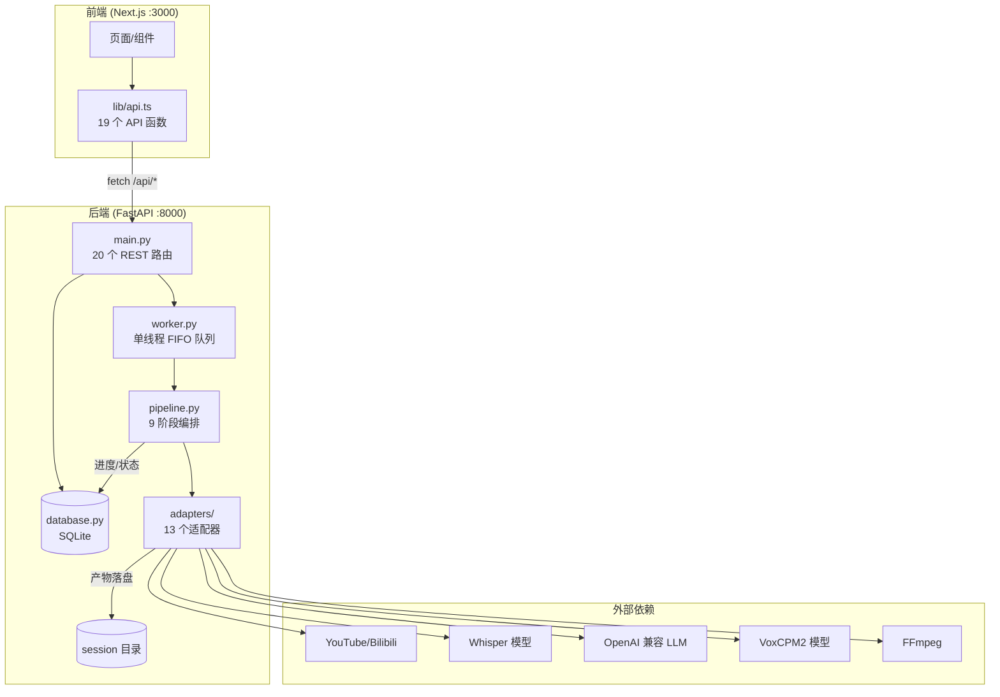
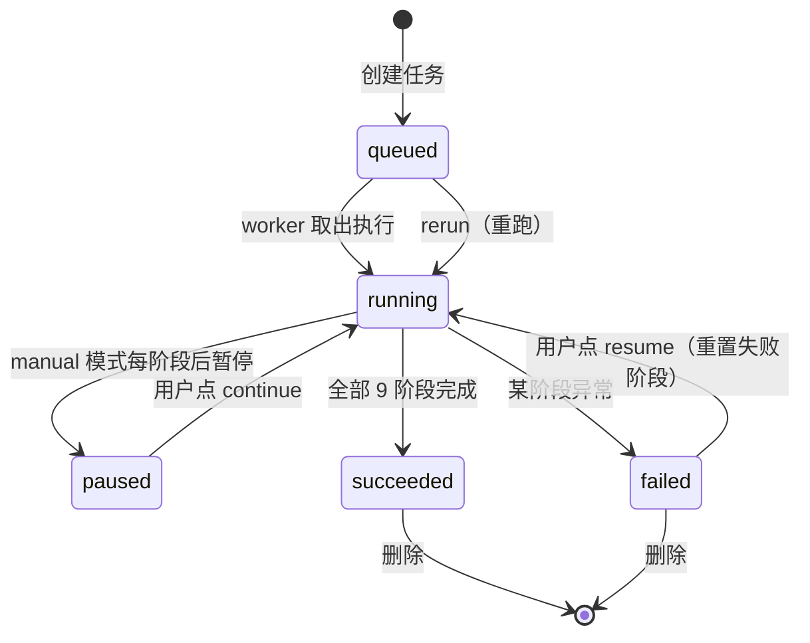
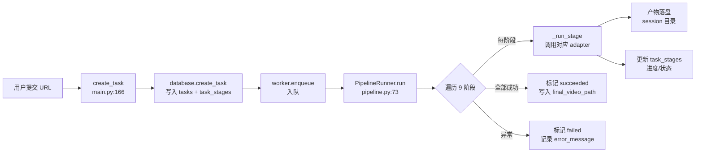
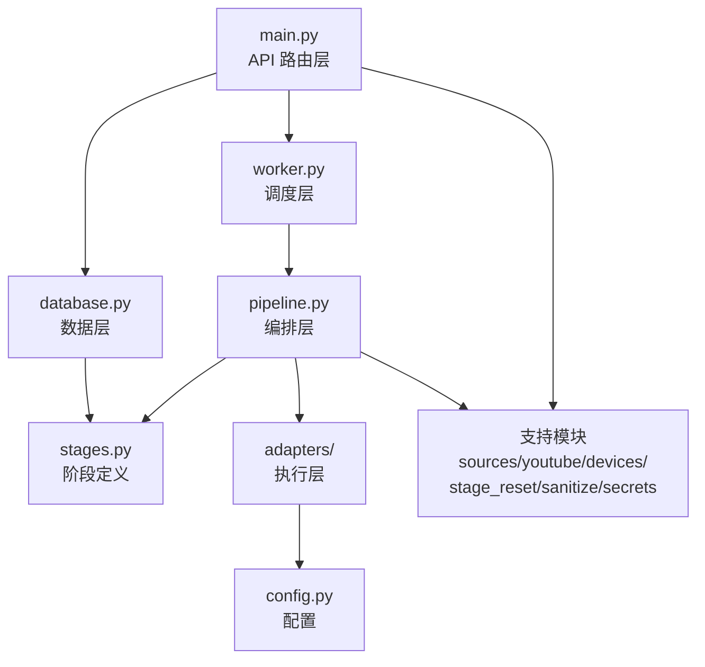

# 02 - 架构与数据流

## TL;DR

前后端分离的本地单体应用。后端 FastAPI 提供 20 个 REST API，SQLite 持久化，单线程 worker 串行执行任务。前端 Next.js 通过 rewrites 代理访问后端，2 秒轮询获取状态。核心是 9 阶段流水线，各阶段调用适配器完成实际工作。

## 整体架构



## 前后端交互机制

### 请求链路

```
浏览器 fetch('/api/...')
  │
  ├── 浏览器端：API_BASE = ""（空串）
  │   → 同源请求 /api/...
  │   → Next.js rewrites 代理到 http://127.0.0.1:8000/api/...
  │   → FastAPI 后端
  │
  └── SSR 端：API_BASE = "http://127.0.0.1:8000"
      → 直连 FastAPI
```

- 配置位置：`apps/web/next.config.ts:13-20`（rewrites 规则）、`apps/web/src/lib/api.ts:1-9`（API base 解析）
- 环境变量：`NEXT_PUBLIC_API_BASE_URL`（浏览器端，默认空）、`NEXT_SERVER_API_BASE_URL`（SSR 端，默认 `http://127.0.0.1:8000`）

### 通信方式

- **无 WebSocket**，前端用 `setInterval` 每 2 秒轮询
  - 首页（`app/page.tsx:94`）：轮询任务列表
  - 详情页（`app/tasks/[id]/page.tsx:204`）：轮询任务详情 + 日志
- 所有 API 返回 JSON，`request<T>()` 通用封装在 `lib/api.ts:68-85`

## 任务生命周期



### 状态流转要点

| 操作 | API 端点 | 数据库变更 | pipeline 行为 |
|---|---|---|---|
| 创建任务 | `POST /api/tasks` | 插入 task + 9 条 task_stages（pending） | 入队 `worker.enqueue` |
| 自动执行 | — | — | `run()` 遍历全部阶段 |
| 手动暂停 | — | 每阶段后 `paused` | `run()` manual 模式每阶段后 break |
| 继续执行 | `POST /api/tasks/{id}/continue` | `paused → running` | 从当前阶段继续 |
| 重做阶段 | `POST /api/tasks/{id}/stages/{name}/redo` | 重置该阶段及后续 | 清理该阶段产物 → 重跑 |
| 恢复失败 | `POST /api/tasks/{id}/resume` | `failed → pending` | 从失败阶段恢复 |
| 重跑任务 | `POST /api/tasks/{id}/rerun` | 重置全部阶段 | 清理全部产物 → 全量重跑 |
| 删除任务 | `DELETE /api/tasks/{id}` | 删除 task + stages | 删除 session 目录 |

### 阶段状态

每个阶段独立维护状态：`pending → running → succeeded/failed`

- 流水线跳过已 `succeeded` 的阶段（缓存恢复，`pipeline.py:96-107`）
- 失败阶段记录 `error_message` 和完整 traceback

## 数据流（单任务完整链路）



### session 目录产物布局

每个任务有一个独立的 session 目录（路径存于 `tasks.session_path`）：

```
session_path/
├── media/
│   ├── video_source.mp4      # 下载/导入的原始视频
│   ├── audio_vocals.wav      # 分离的人声
│   ├── audio_bgm.wav         # 分离的背景音乐
│   └── video_final.mp4       # 最终输出视频
├── metadata/
│   ├── asr.json              # ASR 原始结果
│   ├── asr_fixed.json        # 句子切分修正后
│   ├── translation.{lang}.json  # 翻译结果
│   └── timings.json          # TTS 时间轴对齐信息
├── segments/
│   ├── vocals/*.wav          # 切分的人声参考片段
│   └── tts/*.wav             # TTS 生成的配音片段
└── tmp/
    └── audio_dubbing.wav      # 合并后的完整配音轨
```

> 各阶段产物的详细对应关系见 [03-pipeline.md](03-pipeline.md)

## 模块边界与依赖关系



### 模块职责边界

| 模块 | 职责 | 不应做的事 |
|---|---|---|
| `main.py` | 接收 HTTP 请求，调用 database/worker | 不直接调用 adapters |
| `database.py` | 数据 CRUD | 不含业务逻辑 |
| `worker.py` | 任务调度 | 不含阶段逻辑 |
| `pipeline.py` | 阶段编排 | 不含具体实现（委托给 adapters） |
| `adapters/` | 具体能力实现 | 不直接操作数据库 |
| `stages.py` | 阶段定义 | 纯数据，无逻辑 |
| `stage_reset.py` | 产物清理 | 不执行流水线 |

## 数据库表结构

| 表名 | 关键字段 | 用途 |
|---|---|---|
| `tasks` | `id, url, title, status, current_stage, session_path, final_video_path, error_message, execution_mode, created_at, started_at, completed_at` | 任务主表 |
| `task_stages` | `task_id, name, label, status, progress, started_at, completed_at, last_message, error_message` | 每任务各阶段状态 |
| `settings` | `key, value, updated_at` | 全局设置 KV（openai.*, ytdlp.* 等） |

- 初始化：`database.py:29 init_db()` 建表 + 迁移 + 写入默认设置
- OpenAI 密钥加密存储：`database.py:348/363`，加解密逻辑在 `secrets.py`

## API 路由总览

| 分类 | 端点 | 方法 | 用途 |
|---|---|---|---|
| 健康 | `/api/health` | GET | 健康检查 |
| 任务 | `/api/tasks` | POST | 创建任务（URL） |
| 任务 | `/api/tasks/upload` | POST | 上传本地视频（FormData） |
| 任务 | `/api/tasks` | GET | 任务列表 |
| 任务 | `/api/tasks/current` | GET | 最新任务 |
| 任务 | `/api/tasks/{id}` | GET | 任务详情 |
| 任务 | `/api/tasks/{id}` | DELETE | 删除任务 |
| 任务 | `/api/tasks/{id}/rerun` | POST | 重跑 |
| 任务 | `/api/tasks/{id}/resume` | POST | 恢复失败 |
| 任务 | `/api/tasks/{id}/continue` | POST | 手动继续 |
| 任务 | `/api/tasks/{id}/stages/{name}/redo` | POST | 重做指定阶段 |
| 任务 | `/api/tasks/{id}/log` | GET | 运行日志 |
| 任务 | `/api/tasks/{id}/artifact/final-video` | GET | 最终视频 |
| 设置 | `/api/cookies/youtube` | GET/POST | YouTube Cookie |
| 设置 | `/api/settings/openai` | GET/POST | OpenAI 配置 |
| 设置 | `/api/settings/openai/models` | POST | 可用模型列表 |
| 设置 | `/api/settings/ytdlp` | GET/POST | yt-dlp 配置 |

> 完整的文件→函数映射见 [05-code-map.md](05-code-map.md)
> 修改代码的指引见 [06-change-guide.md](06-change-guide.md)
