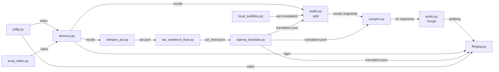

# 04 - 适配器职责表

## TL;DR

`backend/app/adapters/` 下 13 个文件，每个外部能力一个适配器。适配器由 `pipeline.py` 懒加载调用。无统一基类/协议，但每个适配器遵循"输入参数 → 落盘产物"的约定。替换后端时只需保持函数签名和产物格式不变。

## 适配器清单

| 文件 | 职责 | 关键函数 | 可替换后端 |
|---|---|---|---|
| `ytdlp.py` | 视频下载（YouTube/Bilibili） | `download_video(url, workfolder, source, proxy_port)` → (session, info) | yt-dlp |
| `local_video.py` | 本地视频导入 | `import_local_video(url, workfolder, source)` → (session, info) | FFmpeg 转码 |
| `demucs.py` | 人声/BGM 分离 | `separate_audio(video_file, session, progress_callback)` → (vocals.wav, bgm.wav) | Demucs (htdemucs_ft) |
| `whisper_asr.py` | 语音识别（ASR） | `recognize_speech(vocals_file, session, language)` → asr.json | OpenAI Whisper |
| `asr_sentence_fixer.py` | ASR 句子切分修正 | `fix_asr_sentences(asr_file, session, start_pad, end_pad, language)` → asr_fixed.json | 无（纯算法） |
| `local_subtitles.py` | 本地 SRT 字幕解析 | `parse_srt(content)`, `write_uploaded_subtitle_artifacts()` → (asr.json, asr_fixed.json, translation.json) | 无（纯解析） |
| `openai_translate.py` | LLM 翻译 | `translate_asr(asr_file, session, settings, source)` → translation.json | OpenAI 兼容 API |
| `openai_client.py` | OpenAI base_url 规范化 | `normalize_openai_base_url(base_url)` | —（工具函数） |
| `_translate_prompts.py` | 翻译 prompt 模板 | `PREPROCESS_PROMPT`, `TRANSLATE_RULES` (zh/en) | —（常量） |
| `audio.py` | 音频切分 + TTS 合并 + 变速对齐 | `split_audio_by_translation()`, `merge_tts_audio()` → (dubbing.wav, timings.json) | librosa/audiostretchy |
| `voxcpm.py` | TTS 语音合成 | `generate_tts(translation_file, vocals_dir, session, progress_callback)` → tts 目录 | VoxCPM2 (ModelScope) |
| `ffmpeg.py` | FFmpeg 操作 | `write_srt()`, `probe_video_size()`, `merge_video()` → video_final.mp4 | FFmpeg/ffprobe |
| `__init__.py` | 包标识 | — | 注释说明"重量级适配器由 pipeline 懒加载" |

## 接口约定

适配器**无统一基类或 Protocol**，但遵循以下隐式约定：

### 1. 函数式接口

每个适配器导出的是**函数**（非类），由 `pipeline.py` 的阶段处理函数直接调用：

```python
# pipeline.py 中的典型调用模式
from backend.app.adapters import ytdlp
session, info = ytdlp.download_video(url, workfolder, source, proxy_port)
```

### 2. 产物落盘约定

所有适配器将产物写入 `session` 目录的**约定路径**，而非通过返回值传递大文件：

| 适配器 | 产物路径 |
|---|---|
| ytdlp / local_video | `media/video_source.mp4` |
| demucs | `media/audio_vocals.wav`, `media/audio_bgm.wav` |
| whisper_asr | `metadata/asr.json` |
| asr_sentence_fixer | `metadata/asr_fixed.json` |
| openai_translate | `metadata/translation.{lang}.json` |
| audio (split) | `segments/vocals/*.wav` |
| voxcpm | `segments/tts/*.wav` |
| audio (merge) | `tmp/audio_dubbing.wav`, `metadata/timings.json` |
| ffmpeg | `media/video_final.mp4` |

> 这些路径在 `pipeline.py` 的 `_restore_cached_stage`（`:218-261`）和 `stage_reset.py` 的 `STAGE_OWN_ARTIFACTS` 中硬编码引用。

### 3. 进度回调约定

耗时适配器接受 `progress_callback` 参数，用于上报进度：

```python
# 适配器内部调用
if progress_callback:
    progress_callback(current, total, "描述信息")
```

- pipeline 通过 `_run_stage` 传入回调（`pipeline.py:194-216`）
- 回调内部有 2 秒节流（`pipeline.py:144-155`）

### 4. 缓存约定

多数适配器在执行前检查产物是否已存在：

```python
# 典型模式
output_file = session / "media" / "audio_vocals.wav"
if output_file.exists():
    return output_file  # 直接复用
```

## 可替换点与替换指南

### 替换 ASR 后端（Whisper → 其他）

| 项 | 内容 |
|---|---|
| 目标文件 | `adapters/whisper_asr.py` |
| 需保持的函数签名 | `recognize_speech(vocals_file, session, language)` |
| 需保持的产物格式 | `metadata/asr.json`（含 `utterances` + word timestamps） |
| 注意 | asr.json 格式被 `asr_sentence_fixer` 和 `openai_translate` 依赖，格式不兼容会导致后续阶段失败 |
| 设备处理 | 参考 `devices.py` 的 `resolve_device` 获取可用设备 |

### 替换 TTS 后端（VoxCPM → 其他）

| 项 | 内容 |
|---|---|
| 目标文件 | `adapters/voxcpm.py` |
| 需保持的函数签名 | `generate_tts(translation_file, vocals_dir, session, progress_callback)` |
| 需保持的产物格式 | `segments/tts/*.wav`（每句一个文件，文件名需与 translation.json 条目对应） |
| 注意 | `audio.merge_tts_audio` 会读取 tts 目录下的文件并按顺序合并，文件命名约定需一致 |

### 替换翻译后端（OpenAI → 其他 LLM）

| 项 | 内容 |
|---|---|
| 目标文件 | `adapters/openai_translate.py` |
| 需保持的函数签名 | `translate_asr(asr_file, session, settings, source)` |
| 需保持的产物格式 | `metadata/translation.{lang}.json` |
| 配套文件 | `openai_client.py`（base_url 规范化）、`_translate_prompts.py`（prompt 模板） |
| 注意 | 翻译有断点续译逻辑，替换时需保留或重新实现 |

### 替换下载后端（yt-dlp → 其他）

| 项 | 内容 |
|---|---|
| 目标文件 | `adapters/ytdlp.py` |
| 需保持的函数签名 | `download_video(url, workfolder, source, proxy_port)` → (session, info) |
| 需保持的产物 | `media/video_source.mp4` + 返回 info dict（含 title 等） |
| 注意 | `sources.py` 的 `SourceConfig` 决定来源类型，新增来源需在此注册 |

## 新增适配器步骤

1. 在 `adapters/` 下新建文件，实现函数式接口
2. 遵循产物落盘约定（写入 session 目录约定路径）
3. 在 `pipeline.py` 对应阶段处理函数中调用新适配器
4. 如果新增了阶段，在 `stages.py` 的 `STAGES` 中注册
5. 在 `stage_reset.py` 的 `STAGE_OWN_ARTIFACTS` 中注册新产物路径
6. 更新本文档和 `05-code-map.md`

## 适配器依赖关系



> 流水线编排细节见 [03-pipeline.md](03-pipeline.md)
> 代码位置索引见 [05-code-map.md](05-code-map.md)
